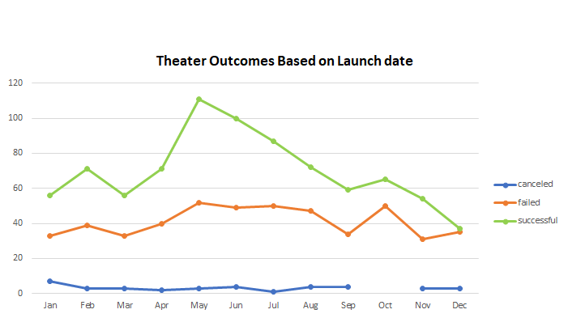

# Excel Kickstarter Analyzis

## Overview of Project

- The purpose of this project is to use the kickstarter data to help a better understanding on how fundraises fare throughout the years and verify when is the best time of the year to launch them for a better chance at success.

## Analyzis and Challenges

### Challenges and Difficulties Encountered

- 
I had a harder time understanding the percentage funded before using the 90 percentile on the conditional data because there were a couple sets of data with a bigger discrepancy than the rest of the set. Due to that only about 2 data sets were showing blue color, needing to sort it from largest to smallest to be able to visualize them.

## Results

- 
Based on outcomes by launch date we were able to verify <strong>May is the best time</strong> of the year to start a fundraiser where the success to failed ratio is about <strong><em>2 to 1</em></strong>. We also verified the last quarter of the year is the worst time becoming very risky success to failed <strong><em>ratio of about 1 to 1</em></strong> even tho there are no canceled fundraisers in October.

- 
Based on the outcomes by goals we were able to verify the most successful fundraisers were the ones with a budget <strong><em>less than $5,000 with over 700 fundraisers</em></strong> having a <strong><em>success rate of over 70%</em></strong>. We also verified a peak in success on the budget between $35,000 & $44,999 but the <strong><em>number of fundraisers is too low to provide an accurate analysis.</em></strong>

- 
This dataset doesn't provide us with data to analyze on how all these fundraisers got advertised and how much was the budget on advertising, limiting us to know the target audience and to provide a better way to improve those fundraisers with said ads.

- 
By creating a table with the launch dates, deadlines, goals and comparing them with the success rate we would be able to analyze how long did those fundraisers were live for. Giving us more information to be able to provide the next fundraiser a better chance at success.

