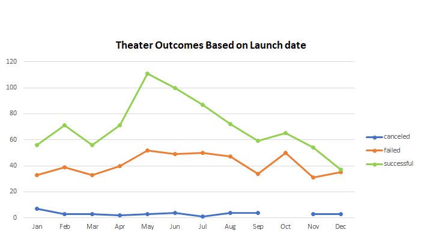

# Excel Kickstarter Analyzis

## Overview of Project

### The purpose of this project is to use the kickstarter data to help a better understanding on how fundraises fare throughout the year and verify when is the best time of the year to launch them for a better chance at success.

## Analyzis and Challenges

### Analyzing the theater data based on launch dates we verified there is a peak of successful theater fundraisers in May, we also verified no cancelations in October and December can be a coin toss on how successful the fundraiser could be.

### By analyzing the fundraisers for plays based on goals we verified  

### Challenges and Difficulties Encountered

## Results

- What are two conclusions you can draw about the Outcomes based on Launch Date?

- What can you conclude about the Outcomes based on Goals?

- What are some limitations of this dataset?

- What are some other possible tables and/or graphs that we could create?
